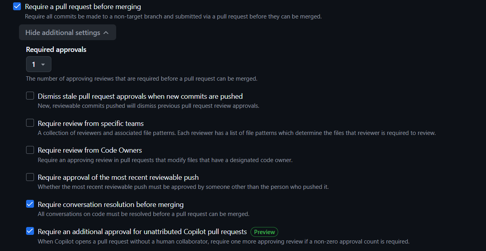

# Laboratorio 1: Gestión de proyectos con Git y GitHub

Repositorio de prácticas para el curso de Desarrollo de Software - Universidad Nacional de Ingeniería. 

Este proyecto implementa buenas prácticas de infraestructura colaborativa, automatización de tableros Kanban, validación local con Git Hooks y protección de ramas.

## Autor 
* **Axel Alberto Reyes Baldeón**

## Evidencias

### 1. Protección de Ramas (Branch Protection)
Configuración de reglas en la rama `main` para requerir Pull Requests, aprobaciones y bloquear push directo.

